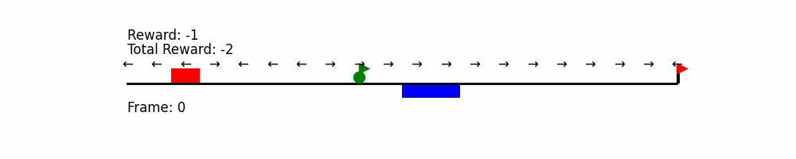
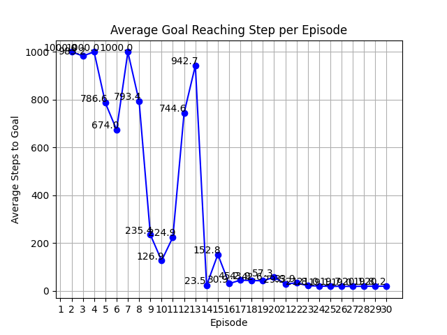

# prob_robotics_2024

## 概要
このリポジトリは、確率ロボティクス2024年度の課題として作成されました。  
1次元の数直線上をエージェントが移動し、Q学習によって最適な方策を学習します。


## 実行方法
以下のコマンドを使用して、必要なPythonライブラリをインストールしてください。
```bash
pip install numpy matplotlib
```
コードの実行は以下のように行います。
```bash
python Q_train.py
```

## 各ファイルの概要
* Q_train.py
  * Q学習を行い、各エピソードを保存します。
* Q_plot_animation_eps.py
  * 学習の結果得られた方策を表示し、それに従いエージェントを移動させますが、確率εでランダムに行動をさせます。（ε-グリーディ方策）
* Q_plot_eps.py
  * 各エピソードによって得た方策ををε-グリーディ方策に従って10回ずつ試行し、平均のゴール時間をグラフにします。
* env_loader.py
  * シミュレーション環境を読み込みます。
* env.csv
  * シミュレーション環境が記述されています。

## Q学習の説明
Q学習の更新式は以下です。

```math
Q(s, a) \leftarrow (1 - \alpha)Q(s, a) + \alpha \left[ r + \max_{a'} Q(s', a') \right]
```

## ε-グリーディ方策
確率$`\epsilon`$でランダムに行動を選択し、確率$`1 - \epsilon`$で$`Q(s, a)`$が最大となる行動を選択します。

## 実行結果
以下は、各エピソードで得られた方策にしたがって、1000ステップを上限として50回ずつ試行したときの平均ゴール時間のグラフです。



エピソードが進むにつれて、エージェントの行動が効率化されていることがわかります。

## 環境設定
env.csv内の意味は以下のとおりです。
|パラメータ|説明|初期値|
|---|---|---|
n_states|数直線の長さ|20
goal_state|ゴール位置|20|
start_state|エージェントの初期位置|8|
obstacles|障害物|2|
water|水たまり|10,11|
actions|エージェントの行動|-1,1|