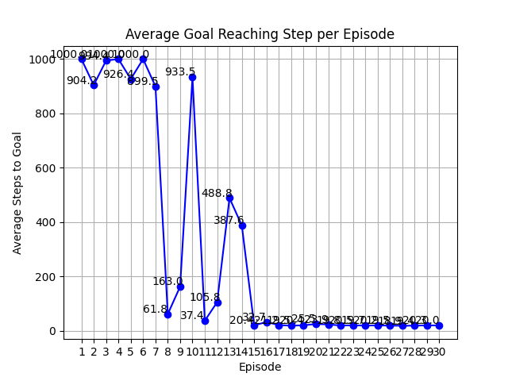

# prob_robotics_2024

## 概要
このリポジトリは、確率ロボティクス2024年度の課題として作成されました。  
1次元の数直線上をエージェントが移動し、Q学習によって最適な方策を学習します。


## 実行方法
以下のコマンドを使用して、必要なPythonライブラリをインストールしてください。
```bash
pip install numpy matplotlib
```
コードの実行は以下のように行います。
```bash
python Q_train.py
```

## 各ファイル、フォルダの概要
* Q_train.py
  * Q学習を行い、各エピソードを保存します。
* Q_plot_animation_eps.py
  * 学習の結果得られた方策を表示し、それに従いエージェントを移動させますが、確率εでランダムに行動をさせます。（ε-グリーディ方策）
* Q_plot_eps.py
  * 各エピソードによって得た方策ををε-グリーディ方策に従って試行し、平均のゴール時間をグラフにします。
* env_loader.py
  * シミュレーション環境を読み込みます。
* env.csv
  * シミュレーション環境が記述されています。
* images
  * 結果などの画像が保存されています。
* policy
  * エピソードごとの方策が保存されています。

## 変数設定
env.csv内の変数の意味は以下のとおりです。

すべての変数は自由に変更可能です。

障害物と水たまりはカンマで区切ることで好きなだけ配置できます。
|パラメータ|説明|初期値|
|---|---|---|
n_states|数直線の長さ|20
goal_state|ゴール位置|19|
start_state|エージェントの初期位置|8|
obstacles|障害物の位置|0|
water|水たまりの位置|10,11|
actions|エージェントの行動|-1,1|

コード内で使用される変数の意味は以下のとおりです。
|変数|説明|初期値|
|---|---|---|
|alpha|更新前の値を考慮する割合|0.5|
|epsilon|ランダムに行動を選択する確率|0.3|
|episodes|エピソード数|30|
|max_steps|最大ステップ|1000|
|num_trials|試行回数|50|

## 報酬設定
エージェントの行動によって得る報酬は以下のとおりです。
|環境|報酬|
|---|---|
|ゴール|100|
|obstacles|-100|
|water|-10|
|1ステップ移動|-1|

## Q学習の説明
Q学習の更新式は以下です。

```math
Q(s, a) \leftarrow (1 - \alpha)Q(s, a) + \alpha \left[ r + \max_{a'} Q(s', a') \right]
```

## ε-グリーディ方策
確率$`\epsilon`$でランダムに行動を選択し、確率$`1 - \epsilon`$で$`Q(s, a)`$が最大となる行動を選択します。

## 実行結果
以下は、各エピソードで得られた方策にしたがって、1000ステップを上限として50回ずつ試行したときの平均ゴール時間のグラフです。



エピソードが進むにつれて、エージェントがゴールするまでの時間が短くなっていることがわかります。

図中のアイコンの意味は以下のとおりです。
|アイコン|意味|
|---|---|
|緑の旗|スタート地点|
|赤い旗|ゴール地点|
|緑の円|エージェント|
|赤い四角形|障害物|
|青い四角形|水たまり|
|矢印|その地点での方策|

以下は、1番目のエピソードで得られた方策に従いエージェントが行動する様子です。


以下は、10番目のエピソードで得られた方策に従いエージェントが行動する様子です。


以下は、20番目のエピソードで得られた方策に従いエージェントが行動する様子です。


以下は、30番目のエピソードで得られた方策に従いエージェントが行動する様子です。


## 実行環境
* python 3.9.13
* 使用ライブラリ
  * numpy 2.0.2
  * matplotlib 3.9.4
* windows 11